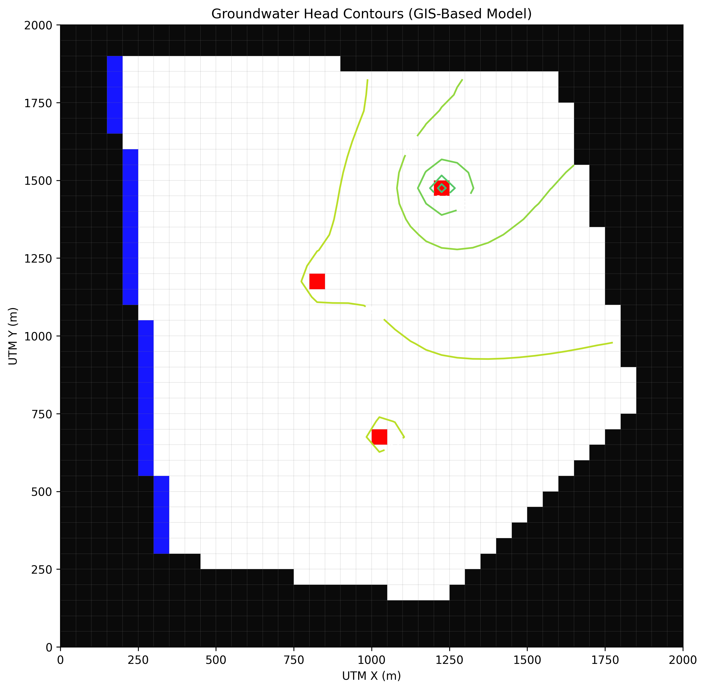

# 🌍 Automated GIS-Based Groundwater Modeling

This project provides a fully automated, Python-based pipeline for simulating groundwater flow using USGS MODFLOW 6 and FloPy. By bypassing traditional commercial GUIs, this framework programmatically translates real-world spatial data (GIS) into finite-difference numerical grids. Key capabilities include mapping vector geometries to raster cells, dynamically generating the active domain (IDOMAIN), and assigning heterogeneous aquifer properties such as variable hydraulic conductivity and areal recharge.

## 📂 Repository Architecture

The workflow is highly modular, strictly separating spatial data generation from numerical model execution:
* **`synthetic_generator/`**: Generates hydrogeologically sound vector and raster datasets, representing natural topography, multi-zone aquifers, and pumping wells.
* **`model_builder/`**: The core engine that performs spatial intersections, interpolates GIS data onto the MODFLOW grid, and constructs the FloPy packages.
* **`gis_data/`**: Stores the raw geospatial inputs, including GeoTIFFs, Shapefiles, and Excel coordinate tables.
* **`gis_model_output/`**: Contains the raw numerical simulation results (`.hds`, `.cbc`, `.lst`) generated by the MODFLOW engine.

## 🚀 Step-by-Step Execution Guide

To run the complete modeling pipeline from scratch, execute the following commands in order:

1. **Generate Spatial Data**: Create the base topography, irregular boundaries, and well coordinates.
   `cd synthetic_generator && python generate_all_data.py`
2. **Add Heterogeneity**: Construct rasters for variable hydraulic conductivity zones and surface recharge.
   `python gen_extra_rasters.py`
3. **Build the Active Domain**: Rasterize the complex aquifer polygon to create the active/inactive `IDOMAIN` array.
   `cd ../model_builder && python build_idomain.py`
4. **Execute the Model**: Map all spatial inputs to FloPy objects and run the MODFLOW 6 solver.
   `python run_gis_model.py`
5. **Extract Water Budget**: Parse the list file to verify mass balance and flux continuity.
   `python extract_budget.py`
6. **Visualize Head Contours**: Generate spatial maps of the groundwater table.
   `python plot_gis_results.py`

## 📊 Results & Visualization

The final output demonstrates the successful translation of continuous real-world geometries into a discrete numerical grid. The visual below highlights the groundwater flow direction, boundary condition interactions, and localized cones of depression caused by active pumping wells.

The automated water budget extraction typically yields a 0.0% mass discrepancy, confirming a highly stable mathematical setup.